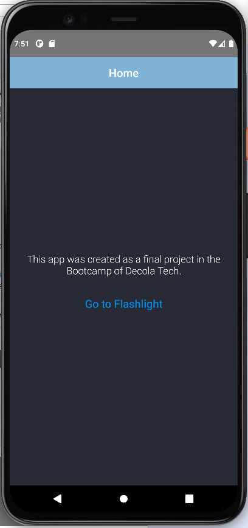
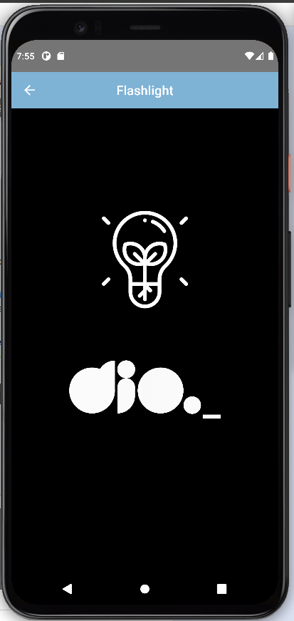
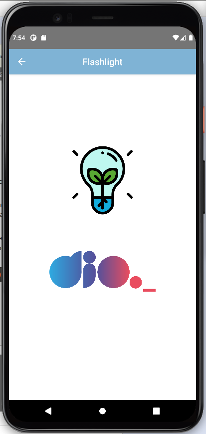

# React Native - DIO Flashlight

  

  

  

# Conteúdo

## Descrição do Projeto

 Projeto realizado no bootcamp da Decola Tech pela DIO. Desenvolvido um App em React Native que utiliza sensor de movimento para ligar e delsigar a lanterna do smartphone.

Essas foram as principais técnicas e tecnologias que pude aprender durante o desenvolvimento desse projeto:

* Libs react-native-shake e react-native-torch
* Styled Components
* Hooks (useState e useEffect)

